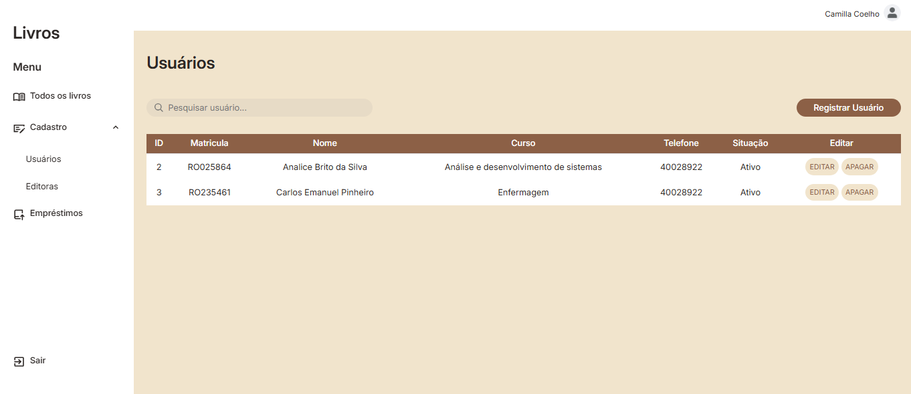

# Sistema de Biblioteca

Sistema de gerenciamento de biblioteca desenvolvido com HTML, CSS e JavaScript. A aplicação permite cadastrar, visualizar, editar e excluir livros, utilizando o LocalStorage para armazenar os dados diretamente no navegador.

## Funcionalidades

* Cadastro de livros
* Listagem de livros cadastrados
* Edição de informações
* Exclusão de registros
* Persistência dos dados com LocalStorage
* Interface responsiva

## Tecnologias Utilizadas

* HTML5
* CSS3
* JavaScript (ES6)
* LocalStorage

## Demonstração

### Tela Inicial


### Cadastro de Usuário



## Como Executar

1. Clone este repositório:

```bash
git clone https://github.com/ElainDev/Sistema_de_Biblioteca.git
```

2. Abra a pasta do projeto.

3. Execute o arquivo `index.html` em qualquer navegador.

Não é necessário instalar dependências ou configurar um servidor.

## Objetivo

O projeto foi desenvolvido para praticar conceitos fundamentais do desenvolvimento Front-End, incluindo:

* Manipulação do DOM
* Eventos em JavaScript
* Estruturas de dados
* Persistência de dados utilizando LocalStorage
* Organização de código
* Desenvolvimento de interfaces web

## Melhorias Futuras

* Autenticação de usuários
* Integração com banco de dados
